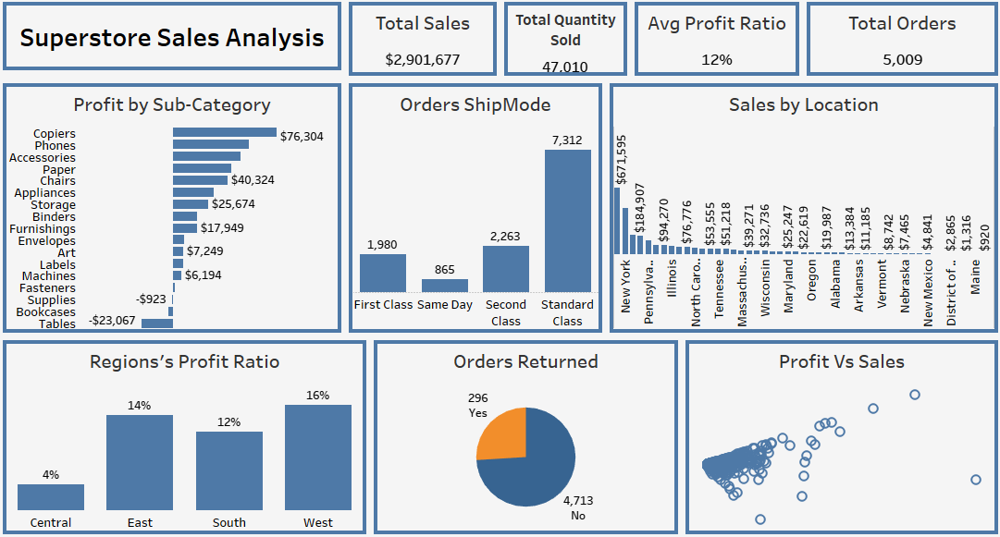

# Superstore Sales Analysis

## Project Overview

This project analyzes sales performance, profitability, customer orders, and regional trends using the Superstore dataset. The dashboard provides business insights into product performance, shipping methods, returns, and sales across different locations to support data-driven decision-making.

---

## Business Problem

The objective of this project was to answer the following business questions:

- Which product categories generate the highest profit?
- Which regions perform best?
- How do shipping methods affect orders?
- Which states generate the highest sales?
- What is the relationship between sales and profit?
- How many orders are returned?

---

## Objectives

- Analyze overall business performance.
- Identify the most profitable products.
- Compare regional performance.
- Evaluate shipping methods.
- Monitor returned orders.
- Build an interactive dashboard for business reporting.

---

## Tools Used

- Microsoft Excel– Data Cleaning and Analysis
- Python – Data Preparation
- Tableau – Data Visualization

---

## Dashboard Features

### Key KPIs

- Total Sales
- Total Quantity Sold
- Average Profit Ratio
- Total Orders

### Visualizations

- Profit by Sub-Category
- Orders by Ship Mode
- Sales by Location
- Regional Profit Ratio
- Returned Orders
- Profit vs Sales Scatter Plot

### Interactive Filters

- Region
- Category
- Sub-Category
- Ship Mode
- Order Date

---

## Key Insights

- New York generated the highest sales among all locations.
- The West region recorded the highest profit ratio.
- Standard Class was the most frequently used shipping method.
- Copiers produced the highest profit among all sub-categories.
- Tables generated a loss, indicating an opportunity for pricing or cost optimization.
- Most orders were successfully delivered without being returned.

---

## Business Recommendations

- Increase investment in highly profitable product categories.
- Review pricing and cost strategies for loss-making products.
- Encourage efficient shipping methods to improve customer satisfaction.
- Replicate successful regional sales strategies in lower-performing regions.
- Monitor returned orders to identify recurring issues.

---

## Skills Demonstrated

- Data Cleaning
- SQL Querying
- Data Visualization
- KPI Reporting
- Business Intelligence
- Profitability Analysis
- Sales Analysis
- Tableau Dashboard Development

---

## Repository Contents

```
Superstore-Sales-Analysis
│
├── README.md
├── Superstore Sales Analysis.twbx
├── SQL Queries.sql
├── Dataset.xlsx
```

---

## Dashboard Preview



---

## About Me

I am an aspiring Data Analyst passionate about transforming data into actionable insights through SQL, Excel, Power BI, and Tableau. My goal is to build dashboards that help businesses make informed, data-driven decisions.
